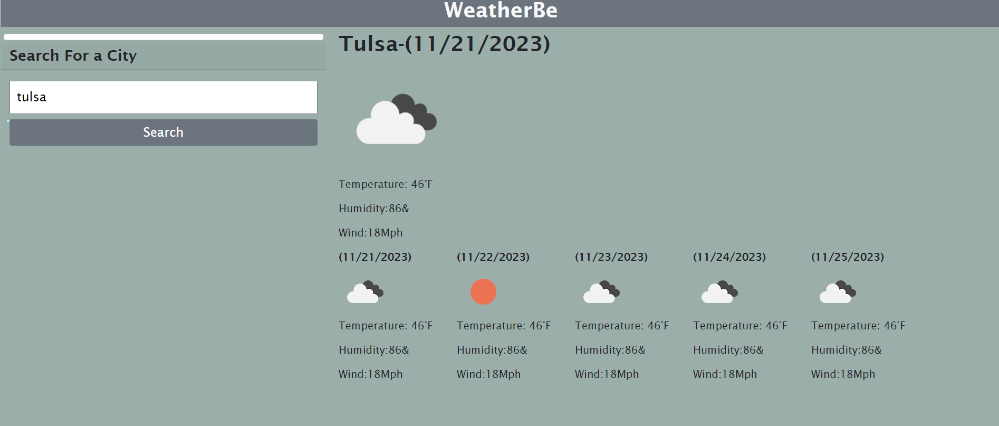

# WeatherBE

## Description 

my challenge is to build a weather dashboard that will run in the browser and feature dynamically updated HTML and CSS.

ill be using  the [5 Day Weather Forecast API ](https://openweathermap.org/forecast5) to retrieve weather data for cities.

## Table of Contents 

- [Description](#description)
- [Languages](#languages)
- [Usage](#usage)

## Languages

- HTML
- Css
- jQuery
- JavaScript

## Usage
-  Vist [GitHub Repo](https://jif945.github.io/Workday-Schedule/)
- User enters a city and clicks search weather will populate below
